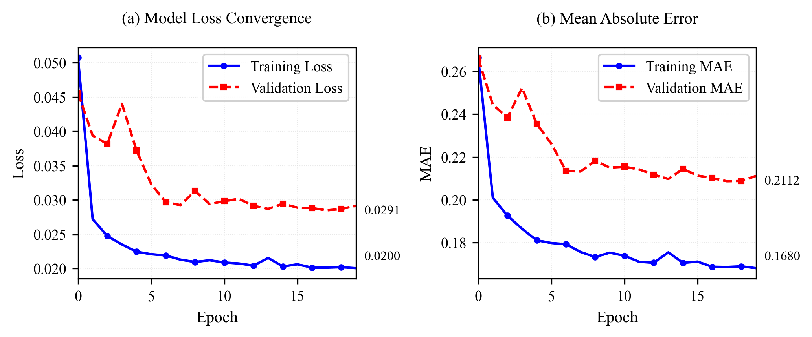
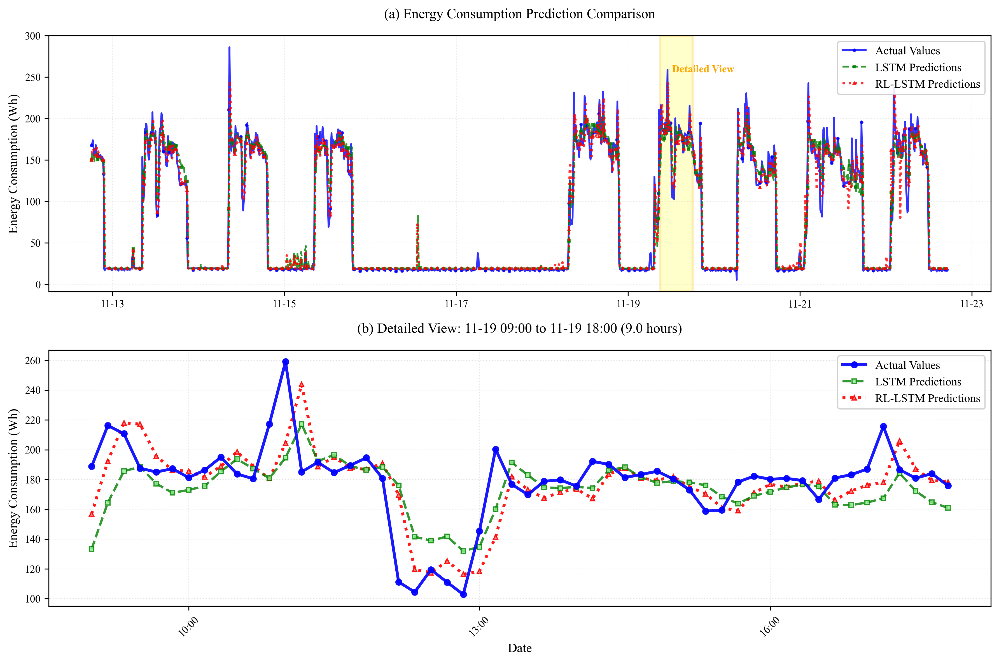

# RL-LSTM Energy Prediction for Office Buildings

An energy consumption prediction system integrating **Bidirectional LSTM** and **Deep Deterministic Policy Gradient (DDPG)** reinforcement learning, designed for non-stationary building energy data caused by variable occupant behavior.

This work is associated with the IEEE conference paper:
> *RL-LSTM and Heuristic Optimization for Energy-Efficient Office Management*  
> ISPDS 2025 (IEEE) | DOI: [10.1109/ISPDS67367.2025.11391185](https://doi.org/10.1109/ISPDS67367.2025.11391185)

---

## Overview

Traditional LSTM models remain static after training and cannot adapt to the non-stationary mapping between environmental parameters and energy consumption caused by users' **Behavioral Change Capacity (BCC)**. This system addresses that by using a **DDPG reinforcement learning agent** to dynamically adjust LSTM model weights at inference time based on real-time prediction errors — enabling continuous adaptation without offline retraining.

**Key results:**
- CVRMSE improved by **23.3%** (0.30 → 0.23) vs. baseline LSTM
- MAPE reduced by **25.2%** (18.36% → 13.73%) vs. baseline LSTM

---

## System Architecture

```
Raw Sensor Data (1-min interval, ~73,000 points)
        │
        ▼
┌─────────────────────┐
│    DataProcessor    │  ← IQR outlier detection, PMV calculation,
│                     │    cyclic time encoding, Japan holiday features,
│                     │    RobustScaler normalization
└────────┬────────────┘
         │
    ┌────┴──────┐
    ▼           ▼
LSTM Train   RL Train    Test
  (60%)       (20%)     (20%)
    │           │
    ▼           ▼
┌────────────────────────────┐
│       LSTMRLSystem         │
│  ┌──────────────────────┐  │
│  │  Bidirectional LSTM  │  │  64 hidden units, BN + Dropout
│  │  (base predictor)    │  │
│  └──────────────────────┘  │
│  ┌──────────────────────┐  │
│  │     DDPG Agent       │  │  Actor-Critic, Experience Replay (cap=10,000)
│  │  (online adaptation) │  │  Action constrained to [-0.01, 0.01]
│  └──────────────────────┘  │
└────────────────────────────┘
         │
         ▼
  Prediction + Evaluation
  (CVRMSE, MAPE)
```

---

## Results

### Training Convergence



Bidirectional LSTM base model converges stably within 20 epochs.

| Metric | Training | Validation |
|---|---|---|
| Final Loss | 0.0200 | 0.0291 |
| Final MAE | 0.1680 | 0.2112 |

---

### Prediction Performance (RL-LSTM vs LSTM)



Panel (a): Full test period (Nov 13–23, 2024) — RL-LSTM consistently tracks actual values more closely than baseline LSTM.  
Panel (b): 9-hour detailed view (Nov 19, 09:00–18:00) — RL-LSTM shows clear advantage during high-variability peak usage periods.

| Metric | LSTM (Baseline) | RL-LSTM (Proposed) | Improvement |
|---|---|---|---|
| CVRMSE | 0.30 | **0.23** | ↓ 23.3% |
| MAPE | 18.36% | **13.73%** | ↓ 25.2% |

The DDPG agent dynamically adjusts LSTM weights at each inference step by computing the normalized prediction error as the RL state signal, generating a continuous learning factor action, and applying gradient-based parameter updates — enabling closed-loop adaptation to behavioral drift.

---

## Features

- **Bidirectional LSTM** with 64 hidden units, BatchNorm, and Dropout for robust temporal modeling
- **DDPG reinforcement learning** agent for online, closed-loop LSTM weight adaptation without retraining
- **PMV (Predicted Mean Vote)** thermal comfort index as an input feature
- **Japan holiday-aware** time feature engineering (`jpholiday`)
- **RobustScaler** for outlier-resilient feature normalization
- **IQR-based outlier detection** for energy data cleaning
- IEEE journal-quality visualization (Times New Roman, 300 DPI, EPS export)

---

## Dataset

Real-world sensor data collected from a small staff office at Kyushu University, Japan (Oct–Nov 2024).

| Feature | Description |
|---|---|
| `indoor_temperature` | Indoor air temperature (°C) |
| `indoor_humidity` | Indoor relative humidity (%) |
| `indoor_globe_temperature` | Globe temperature for MRT/PMV calculation (°C) |
| `indoor_co2` | CO₂ concentration (ppm) |
| `indoor_lux` | Illuminance (lux) |
| `outdoor_temperature` | Outdoor air temperature (°C) |
| `outdoor_relativehumidity` | Outdoor relative humidity (%) |
| `total_electric[Wh]` | **Target**: Total electricity consumption (Wh) |

Sampling interval: 1 minute → resampled to 10 minutes  
Total records: ~73,000 data points

---

## Requirements

```bash
pip install torch pandas numpy scikit-learn matplotlib pythermalcomfort jpholiday
```

Python 3.9+ recommended.

---

## Usage

```bash
# Place merged_data.csv in the project root
python main.py
```

The script will:
1. Load and preprocess sensor data (outlier detection, resampling)
2. Calculate PMV thermal comfort index
3. Engineer time features (cyclic encoding, Japanese holidays)
4. Train Bidirectional LSTM base model (20 epochs, 60% data)
5. Train DDPG RL agent (100 episodes, 20% data)
6. Evaluate and compare LSTM vs RL-LSTM on test set (20% data)
7. Save models to `models/` directory
8. Export IEEE-quality figures (PNG + EPS)

---

## File Structure

```
├── main.py                      # Main training and evaluation pipeline
├── lstm_rl_model.py             # Model definitions (BiLSTM, DDPG, DataProcessor)
├── merged_data.csv              # Sensor dataset (Oct–Nov 2024, Kyushu University)
├── training_curves.png          # LSTM training loss & MAE curves
├── prediction_results.png       # LSTM vs RL-LSTM prediction comparison
├── models/                      # Saved model weights (generated on run)
│   ├── rl_lstm_model.pth
│   ├── rl_actor.pth
│   ├── rl_critic.pth
│   └── best_lstm_params.pkl
└── README.md
```

---

## Citation

```bibtex
@inproceedings{wang2025rl,
  title={RL-LSTM and Heuristic Optimization for Energy-Efficient Office Management},
  author={Wang, Xiangyu and Chen, Yutong and Ishibashi, Soichiro and Oh, Jewon and Ueno, Takahiro and Sumiyoshi, Daisuke},
  booktitle={Proceedings of the 6th International Conference on Information Science, Parallel and Distributed Systems (ISPDS 2025)},
  year={2025},
  doi={10.1109/ISPDS67367.2025.11391185}
}
```

---

## Related Work

This repository implements the RL-LSTM prediction module of the broader **BI-TECH** system. For the full system including occupancy detection and IoT framework, see:

> Y. Chen et al., "BI-Tech: An IoT-Based Behavioral Intervention System for User-Driven Energy Optimization in Commercial Spaces," *IEEE Access*, vol. 13, pp. 166853–166872, 2025. DOI: [10.1109/ACCESS.2025.3607329](https://doi.org/10.1109/ACCESS.2025.3607329)

---

## Author

**Wang Xiangyu (王 翔宇)**  
Doctoral Student, Graduate School of Human-Environment Studies  
Kyushu University, Japan  
wang.xiangyu.425@s.kyushu-u.ac.jp
